02_viz
================

``` r
library(tidyverse)
```

    ## ── Attaching core tidyverse packages ──────────────────────── tidyverse 2.0.0 ──
    ## ✔ dplyr     1.2.1     ✔ readr     2.2.0
    ## ✔ forcats   1.0.1     ✔ stringr   1.6.0
    ## ✔ ggplot2   4.0.3     ✔ tibble    3.3.1
    ## ✔ lubridate 1.9.5     ✔ tidyr     1.3.2
    ## ✔ purrr     1.2.2     
    ## ── Conflicts ────────────────────────────────────────── tidyverse_conflicts() ──
    ## ✖ dplyr::filter() masks stats::filter()
    ## ✖ dplyr::lag()    masks stats::lag()
    ## ℹ Use the conflicted package (<http://conflicted.r-lib.org/>) to force all conflicts to become errors

``` r
library(p8105.datasets)
library(patchwork)
data("weather_df")
```

\##colors start with scatter

``` r
weather_df |>
  ggplot(aes(x = tmax, y = tmin, colour = name)) +
  geom_point() +
  labs(
    title = "temperature",
    x = "max temperature",
    y = "min temperaturer",
    color = "location",
    caption = "data frame NOAA for 3 weather stations"
  ) +
  scale_x_continuous(
    breaks = c(-10, 0, 15),
    labels = c("-10 C", "0", "fifteen")
  ) +
  scale_y_continuous(
    trans = "sqrt",
    position = "right"
  )
```

    ## Warning in transformation$transform(x): 产生了NaNs

    ## Warning in scale_y_continuous(trans = "sqrt", position = "right"): sqrt
    ## transformation introduced infinite values.

    ## Warning: Removed 520 rows containing missing values or values outside the scale range
    ## (`geom_point()`).

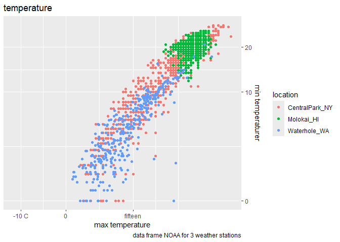<!-- -->

lets look at the colors

``` r
weather_df |>
  ggplot(aes(x = tmax, y = tmin, colour = name)) +
  geom_point() + 
  scale_color_hue(h = c(500,200))
```

    ## Warning: Removed 17 rows containing missing values or values outside the scale range
    ## (`geom_point()`).

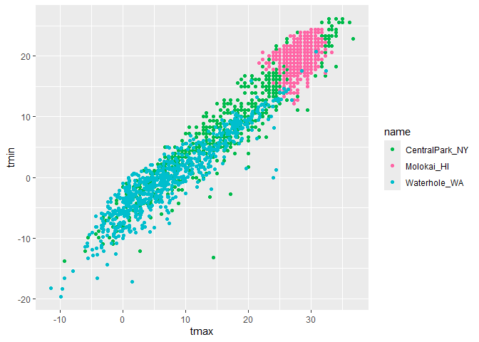<!-- -->

viridis最常用

``` r
weather_df |>
  ggplot(aes(x = tmax, y = tmin, colour = name)) +
  geom_point() + 
  viridis::scale_color_viridis(
    name = "Location",
    discrete = TRUE
  )
```

    ## Warning: Removed 17 rows containing missing values or values outside the scale range
    ## (`geom_point()`).

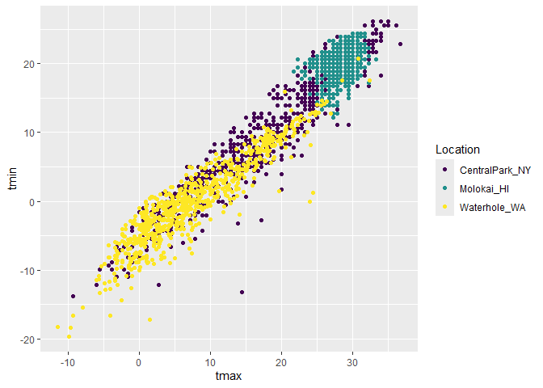<!-- -->

\##themes

theme_bw() theme_classic

``` r
weather_df |>
  ggplot(aes(x = tmax, y = tmin, colour = name)) +
  geom_point() + 
  viridis::scale_color_viridis(
    name = "Location",
    discrete = TRUE
  ) + 
  theme_bw() +
  theme(legend.position = "bottom")
```

    ## Warning: Removed 17 rows containing missing values or values outside the scale range
    ## (`geom_point()`).

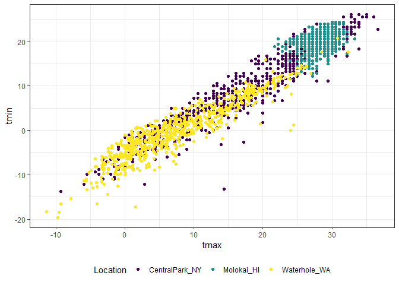<!-- -->

先设置theme再调位置

``` r
weather_df |>
  ggplot(aes(x = tmax, y = tmin, colour = name)) +
  geom_point() + 
  viridis::scale_color_viridis(
    name = "Location",
    discrete = TRUE
  ) + 
  theme(legend.position = "bottom") +
  theme_bw() 
```

    ## Warning: Removed 17 rows containing missing values or values outside the scale range
    ## (`geom_point()`).

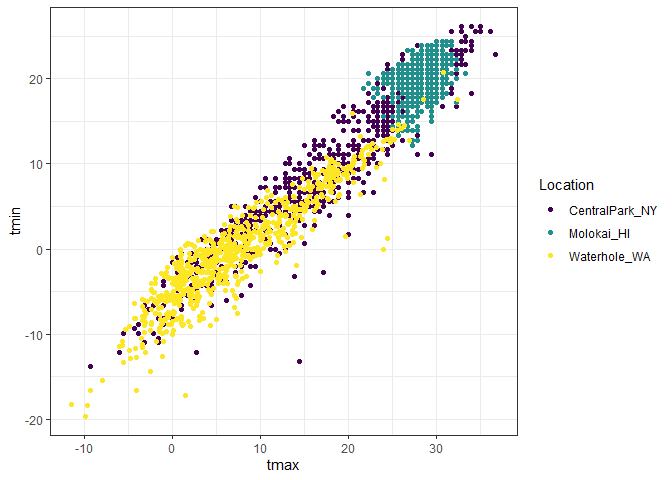<!-- -->

exercise

``` r
weather_df |>
  ggplot(aes(x = date, y = tmax, colour = name)) +
  geom_point() + 
  geom_smooth(se = FALSE) +
  labs(
    title = "seasonal trends",
    x = "date",
    y = "max temperaturer",
    color = "location",
    caption = "max daily temp in 3 weather stations in 2021 and 2020",
  ) +
  viridis::scale_color_viridis(
    discrete = TRUE
  ) + 
  theme_minimal() +
  theme(legend.position = "bottom") 
```

    ## `geom_smooth()` using method = 'loess' and formula = 'y ~ x'

    ## Warning: Removed 17 rows containing non-finite outside the scale range
    ## (`stat_smooth()`).

    ## Warning: Removed 17 rows containing missing values or values outside the scale range
    ## (`geom_point()`).

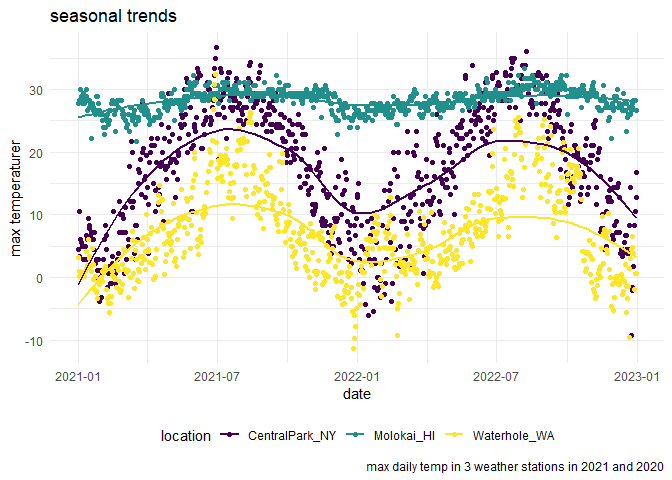<!-- -->

\##two more weird but useful plot things

``` r
central_park_df =
  weather_df |>
  filter(name == "CentralPark_NY")

molokai_df =
  weather_df |>
  filter(name == "Molokai_HI")

ggplot(molokai_df, aes(x = date, y = tmax, color = name)) +
  geom_point() +
  geom_line(data = central_park_df)
```

    ## Warning: Removed 1 row containing missing values or values outside the scale range
    ## (`geom_point()`).

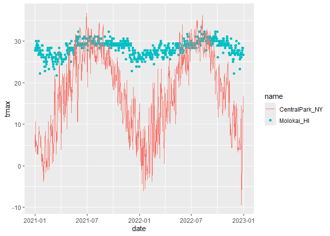<!-- -->

multiple panels with different plot types

``` r
ggp_tmax_tmin =
  weather_df |>
  ggplot(aes(x = tmin, y = tmax, color = name)) +
  geom_point() +
  theme(legend.position = "none")

ggp_prcp_density =
  weather_df |>
  filter(prcp >0) |>
  ggplot(aes(x = prcp, fill = name)) +
  geom_density(alpha = 0.5) +
  theme(legend.position = "none")

ggp_seasonal =
  weather_df |>
  ggplot(aes(x = date, y = tmin, colour = name)) +
  geom_point() +
  theme(legend.position = "bottom")

(ggp_tmax_tmin + ggp_prcp_density)/ggp_seasonal
```

    ## Warning: Removed 17 rows containing missing values or values outside the scale range
    ## (`geom_point()`).
    ## Removed 17 rows containing missing values or values outside the scale range
    ## (`geom_point()`).

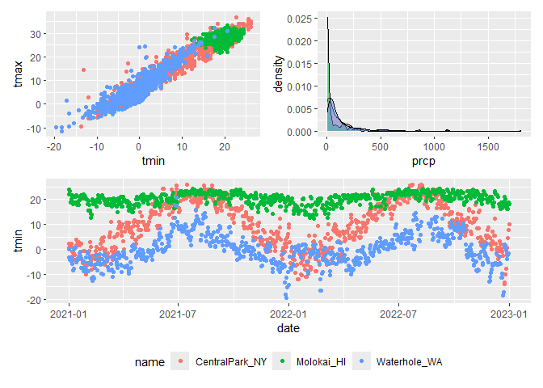<!-- -->

\##data manipulation

start with some factors

boxplots!

``` r
weather_df |>
  mutate(name = fct_relevel(name, c("Molokai_HI", "CentralPark_NY", "Waterhole_WA"))) |>
  ggplot(aes(x = name, y = tmax)) +
  geom_boxplot()
```

    ## Warning: Removed 17 rows containing non-finite outside the scale range
    ## (`stat_boxplot()`).

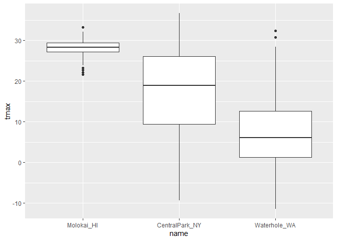<!-- -->

``` r
weather_df |>
  mutate(name = fct_reorder(name, tmax)) |>
  ggplot(aes(x = name, y = tmax)) +
  geom_boxplot()
```

    ## Warning: There was 1 warning in `mutate()`.
    ## ℹ In argument: `name = fct_reorder(name, tmax)`.
    ## Caused by warning:
    ## ! `fct_reorder()` removing 17 missing values.
    ## ℹ Use `.na_rm = TRUE` to silence this message.
    ## ℹ Use `.na_rm = FALSE` to preserve NAs.

    ## Warning: Removed 17 rows containing non-finite outside the scale range
    ## (`stat_boxplot()`).

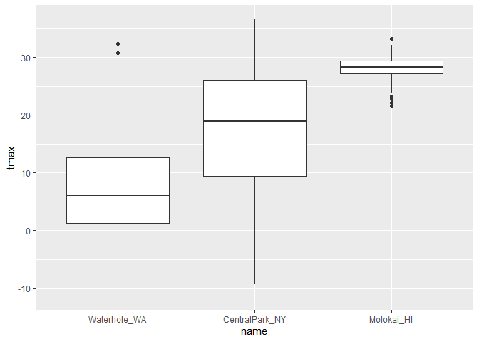<!-- -->

applications(make distribution plot)

``` r
weather_df |>
  select(name, tmax, tmin) |>
  pivot_longer(
    tmax:tmin,
    names_to = "observation",
    values_to = "temp"
  ) |>
  ggplot(aes(x = temp, fill = observation)) +
  geom_density(alpha = 0.5) +
  facet_grid(. ~ name)
```

    ## Warning: Removed 34 rows containing non-finite outside the scale range
    ## (`stat_density()`).

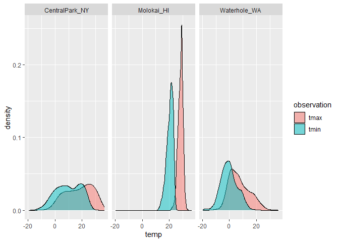<!-- -->

make a FAS plot

``` r
pups_df =
  read_csv("FAS_pups.csv", skip =3, na = c("", ".", "NA")) |>
  janitor::clean_names()
```

    ## Rows: 313 Columns: 6
    ## ── Column specification ────────────────────────────────────────────────────────
    ## Delimiter: ","
    ## chr (1): Litter Number
    ## dbl (5): Sex, PD ears, PD eyes, PD pivot, PD walk
    ## 
    ## ℹ Use `spec()` to retrieve the full column specification for this data.
    ## ℹ Specify the column types or set `show_col_types = FALSE` to quiet this message.

``` r
litters_df =
  read_csv("FAS_litters.csv", na = c("", ".", "NA")) |>
  janitor::clean_names() |>
  separate(group, into = c("dose", "day_of_tx"), 3)
```

    ## Rows: 49 Columns: 8
    ## ── Column specification ────────────────────────────────────────────────────────
    ## Delimiter: ","
    ## chr (2): Group, Litter Number
    ## dbl (6): GD0 weight, GD18 weight, GD of Birth, Pups born alive, Pups dead @ ...
    ## 
    ## ℹ Use `spec()` to retrieve the full column specification for this data.
    ## ℹ Specify the column types or set `show_col_types = FALSE` to quiet this message.

``` r
fas_df =
  left_join(pups_df, litters_df, by = "litter_number")

fas_df |>
  select(dose, day_of_tx, starts_with("pd")) |>
  pivot_longer(
    starts_with("pd"),
    names_to = "outcome",
    values_to = "pn_day"
  ) |>
  drop_na() |>
  ggplot(aes(x = dose, y = pn_day)) +
  geom_boxplot() +
  facet_grid(day_of_tx ~ outcome)
```

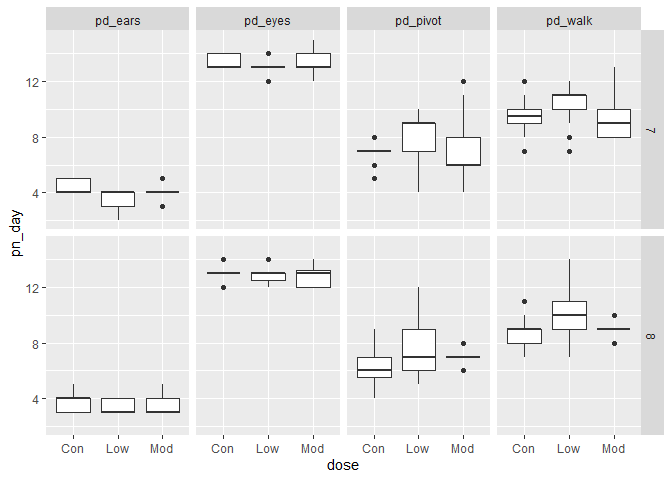<!-- -->
